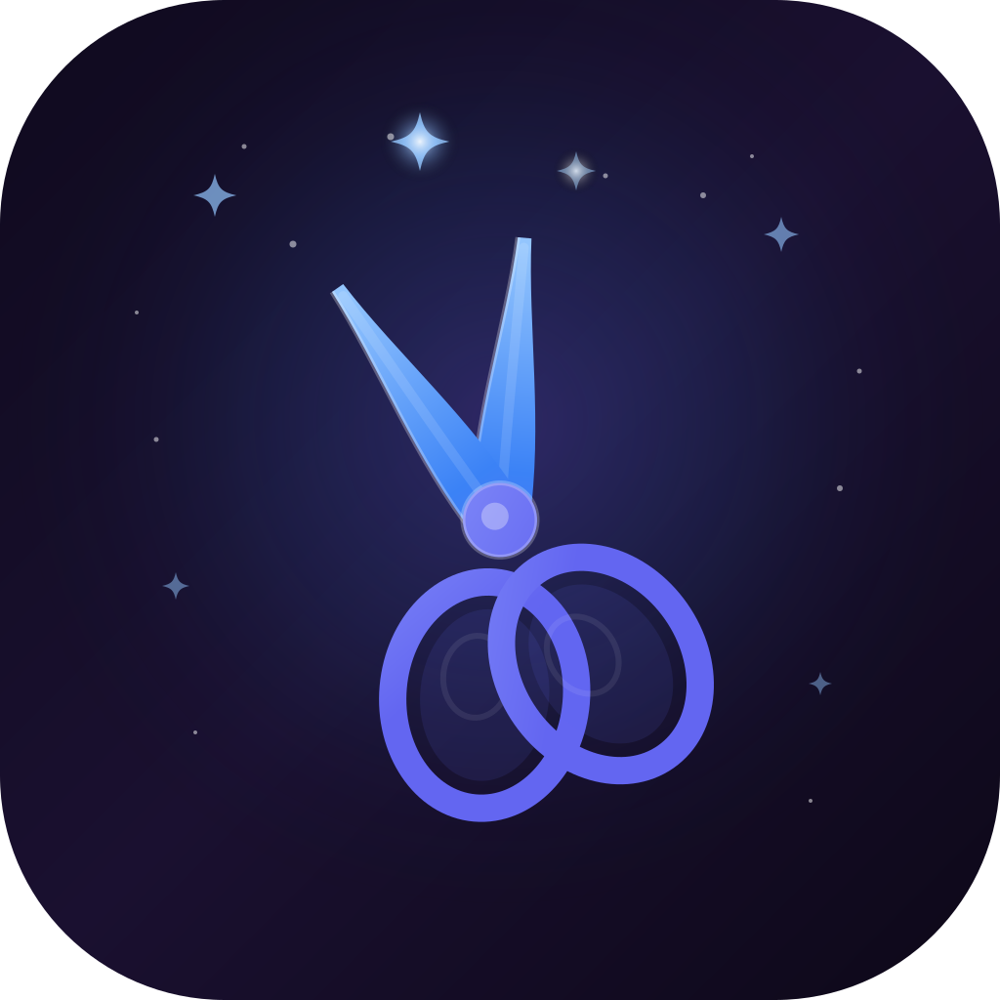

<p align="center">
  
</p>

# Snip

**[rixinhahaha.github.io/snip](https://rixinhahaha.github.io/snip/)**

macOS screenshot tool with annotation and AI-powered organization.

Capture a region of your screen, annotate with shapes, text, blur, or AI segmentation, then save. An AI agent automatically categorizes, names, and tags each screenshot. Semantic search lets you find any screenshot by description.

## Quick Start

```bash
npm install
npm run rebuild   # compile native modules
npm start         # launch (tray icon appears in menu bar)
```

Requires **macOS 14+**, **Node.js 18+**, and **Xcode CLT** (`xcode-select --install`). macOS 26+ recommended for native Liquid Glass effects.

For AI-powered organization, install [Ollama](https://ollama.com/download) separately. Snip detects your system Ollama and guides you through setup in Settings.

## How It Works

1. **Cmd+Shift+2** — Fullscreen overlay appears on whichever display the cursor is on, drag to select a region
2. **Annotate** — Rectangle, arrow, text, tag, blur brush, or AI segment tools
3. **Esc** — Copies annotated screenshot to clipboard
4. **Cmd+S** — Saves to disk + AI organizes in background

Screenshots saved to `~/Documents/snip/screenshots/`. AI renames, categorizes, and indexes them for search.

## Key Shortcuts

| Shortcut | Action |
|----------|--------|
| Cmd+Shift+2 | Capture screenshot |
| Cmd+Shift+F | Open semantic search |
| Cmd+S | Save to disk (in editor) |
| Esc / Enter | Copy to clipboard & close (in editor) |
| V / R / T / A / G / B / S | Select / Rectangle / Text / Arrow / Tag / Blur / Segment tools |

## Documentation

| Doc | Role | Contents |
|-----|------|----------|
| [`docs/PRODUCT.md`](docs/PRODUCT.md) | Product Manager | Vision, feature specs, terminology, product principles |
| [`docs/DESIGN.md`](docs/DESIGN.md) | Designer | Color palettes (Dark/Light/Glass), component patterns, glass effects, icon specs |
| [`docs/ARCHITECTURE.md`](docs/ARCHITECTURE.md) | Developer | Code structure, conventions, IPC channels, data flow, key decisions |
| [`docs/DEVOPS.md`](docs/DEVOPS.md) | DevOps | Build pipeline, signing, native modules, environment setup |
| [`docs/USER_FLOWS.md`](docs/USER_FLOWS.md) | QA / PM | Detailed user flows for every feature, edge cases, test cases |
| [`CLAUDE.md`](CLAUDE.md) | Claude Code | Autonomous agent instructions, role references, documentation rules |

## Tech Stack

Electron 33 / Fabric.js 7 / Ollama (local LLM) / HuggingFace Transformers.js / SlimSAM (ONNX) / Chokidar 4 / electron-liquid-glass

## License

MIT
